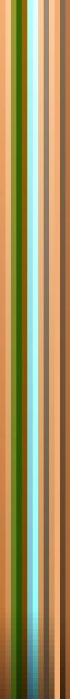
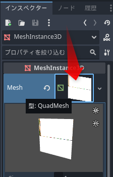
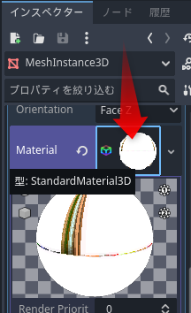
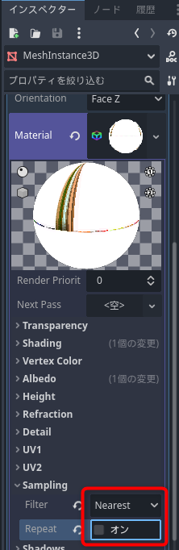
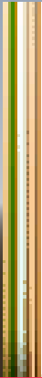
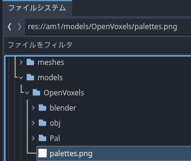
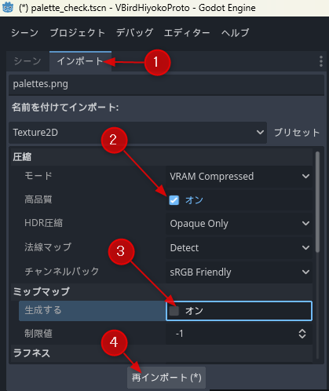
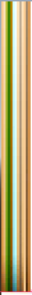

# テクスチャーのにじみを解消する

次のようなテクスチャーを使って、ボクセルモデルにグラデーションをつけようとしていたときのことです。

BlenderでUVを設定して、次のようなモデルができました。

これをGodotに読み込んでみると、期待とは違う見た目になってしまいました。

このような症状の原因と対策です。

## マテリアルのサンプリングの修正

原因は、マテリアルのSamplingと、テクスチャーのインポート設定の両方にありました。

Godotの3D用のテクスチャーは、デフォルトでは、リニアサンプリングをします。そのため、グラデーションが横方向ににじんでしまい、変色の原因になりました。モデルのインスペクターから、マテリアルのSampling設定で、この設定を修正できます。

- シーンドックで、対象のモデルを選択します
- インスペクターで、Meshをクリックして開きます

- Materialをクリックして開きます

- Samplingの項目を開いて、FilterをNearest、Repeatのチェックを外します

以上で、テクスチャーのアンチエイリアスが解除されて、ドットがくっきりと表示されるようになります。Repeatがついていると、端のテクスチャーに影響が出る恐れがあるので、外しました。

3Dでも、テクスチャーのドットをはっきりと見せたい場合は、この設定をするとよいでしょう。もし、ミップマップを使う予定があれば、Nearest Mipmapや、Nearest Mipmap Anisotropicにします。遠方でもくっきり見せたい場合、後者が有効です。

ドットはくっきりしましたが、グラデーションの途中に縞模様が表れています。

これは、テクスチャーの圧縮設定が原因です。そこを修正します。

## テクスチャーのインポート設定

Godotは、3Dモデルに貼られているテクスチャーをインポートすると、デフォルトではビデオカード圧縮をがっつり効かせます。この圧縮が、岩や地面などの写実的なテクスチャー向けのもので、グラデーションのような意図的な色変化の圧縮は苦手としています。圧縮の品質を上げれば、対処できます。

- ファイルシステムドックから、対象の画像ファイルを選択します

- シーンドックからインポートドックに切り替えて、高品質にチェック、ミップマップを外したら、再インポートをクリックします（インポートドックの存在に気づくのに手間取りました^^;)

以上で完了です。元の画像のようなグラデーションが、きれいに描画されるようになりました。

## まとめ

Godotの3Dモデル用のテクスチャーは、デフォルトでは自然物の読み込みに最適化されています。そのため、グラデーションテクスチャーや、ボクセルのテクスチャーといった、ドット単位で見せたい画像が期待したように表示されません。マテリアルのフィルター設定も、無条件に線形補完されるので、画像がぼやけます。マテリアルのサンプリングのフィルターをNearestにして解除して、インポート時の圧縮を高品質にすることで、元画像をほぼそのまま表示できるようになります。

圧縮を高品質にすることで、容量は増えます。しかし、ドット絵的にテクスチャーを利用する場合は、枚数は少なく、解像度も小さいことがほとんどです。問題になることは少ないでしょう。

もし、容量的な問題があれば、インポート設定の圧縮モードで、最適なものを選択するとよいでしょう。参考URLのGODOT DOCSの参考ページに、各種設定の影響が掲載されています。

## 参考URL

- [GODOT DOCS. イメージのインポート](https://docs.godotengine.org/ja/4.x/tutorials/assets_pipeline/importing_images.html)

